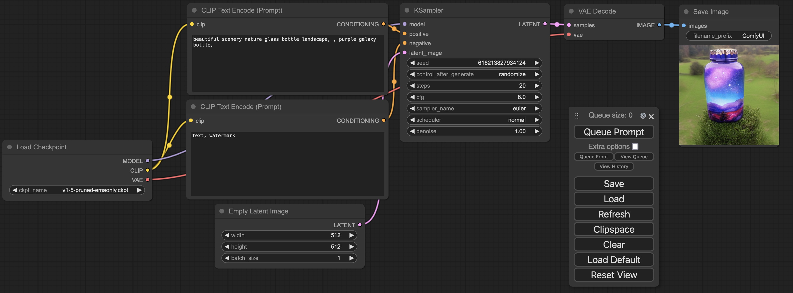

<h1>ComfyUI (NVIDIA) Docker</h1>

[ComfyUI](https://github.com/comfyanonymous/ComfyUI/tree/master) is a Stable Diffusion WebUI. 
With the recent addition of a [Flux example](https://comfyanonymous.github.io/ComfyUI_examples/flux/), I created this container builder to test it.

The container size (over 5GB) contains the required components on an Ubuntu 22.04 image with Nvidia CUDA and CuDNN (the base container is available from Nvidia's DockerHub); we add the requirements components to support an installation of ComfyUI.

During its first run, it will download ComfyUI from git (into the `run/ComfyUI` folder), then create a Python virtual environments (in `run/venv`) for all the python packages needed by the tool. It will then install [ComfyUI Manager](https://github.com/ltdrdata/ComfyUI-Manager) into ComfyUI's `custom_nodes` directory. 
This adds an expected 5GB of content to the installation. This also takes as much time to complete as is needed depending on your internet connection.  
You will know the ComfyUI WebUI is running when you check the `docker logs` and see `To see the GUI go to: http://0.0.0.0:8188`

**About 10GB of space is needed between the container and the virtual environment additional installation.**
This does not take into account the models and other additional packages installation that the end user might perform.

**It is required to re-run the container after first installation to enable the change to the ComfyUI Manager `security_leval` (we run it within a container, as such we need to expose the WebUI to 0.0.0.0). Without this step, the tool will be unable to update/install content.**

It is recommended to have a container monitoring tool available to watch the logs and see when installation are completed, or other relevant messages:
some updates will take a long time (updating packages, downloading content, ...) and the lack of updates on the WebUI is not a sign of failure.
[Dozzle](https://github.com/amir20/dozzle) is a good solution to follow the logs from a WebUI.


- [1. Preamble](#1-preamble)
- [2. Running the container](#2-running-the-container)
  - [2.1. docker run](#21-docker-run)
  - [2.2. Docker compose](#22-docker-compose)
  - [2.3. First time use](#23-first-time-use)
- [3. Docker image](#3-docker-image)
  - [3.1. Building the image](#31-building-the-image)
  - [3.2. Availability on DockerHub](#32-availability-on-dockerhub)
  - [3.3. Unraid availability](#33-unraid-availability)
  - [3.4. Nvidia base container](#34-nvidia-base-container)
- [4. Screenshots](#4-screenshots)
  - [4.1. First run: Bottle image](#41-first-run-bottle-image)
  - [4.2. FLUX.1\[dev\] example](#42-flux1dev-example)
- [5. FAQ](#5-faq)
  - [5.1. Virtualenv](#51-virtualenv)
  - [5.2. user\_script.bash](#52-user_scriptbash)
  - [5.3. Available environment variables](#53-available-environment-variables)
    - [5.3.1. WANTED\_UID and WANTED\_GID](#531-wanted_uid-and-wanted_gid)
    - [5.3.2. COMFY\_CMDLINE\_BASE and COMFY\_CMDLINE\_XTRA](#532-comfy_cmdline_base-and-comfy_cmdline_xtra)
  - [5.4. ComfyUI Manager](#54-comfyui-manager)
  - [5.5. Additional FAQ](#55-additional-faq)
- [6. Troubleshooting](#6-troubleshooting)
- [7. Changelog](#7-changelog)

# 1. Preamble

This build is made to NOT run as the `root` user, but run within the container as a `comfy` user using the UID/GID requested at `docker run` time (if none are provided, the container will use 1024/1024).
This is done to a allow end users to have local directory structures for all the side data (input, output, temp, user), Hugging Face `HF_HOME` if used, and the entire `models` being separate from the container and able to be altered by the user.
To request a different UID/GID at run time use the `WANTED_UID` and `WANTED_GID` environment variables when calling the container.

Note: 
- for details on how to set up a Docker to support an NVIDIA GPU on an Ubuntu 24.04 system, please see [Setting up NVIDIA docker & podman (Ubuntu 24.04)](https://blg.gkr.one/20240404-u24_nvidia_docker_podman/)
- If you are new to ComfyUI, see [OpenArt's ComfyUI Academy](https://openart.ai/workflows/academy)
- Some ComfyUI examples:
  - [ComfyUI_examples](https://comfyanonymous.github.io/ComfyUI_examples/)
  - [ComfyUI FLUX examples](https://comfyanonymous.github.io/ComfyUI_examples/flux/)
- Some additional reads:
  - [FLUX.1[dev] with ComfyUI and Stability Matrix](https://blg.gkr.one/20240810-flux1dev/)
  - [FLUX.1 LoRA training](https://blg.gkr.one/20240818-flux_lora_training/)

# 2. Running the container

In the directory where we intend to run the container, create the `run` folder as the user that we want to share the UID/GID with **before running the container (the container is started as root, as such the folder if it does not exist will be created as root)** (or give it another name, just be adapt the `-v` mapping in the `docker run` below). 

That `run` folder will be populated with a few sub-directories created with the UID/GID passed on the command line (see the command line below). 
Among the folders that will be created within `run` are `HF, ComfyUI, venv`
- `HF` is the expected location of the `HF_HOME` (HuggingFace installation directory)
- `ComfyUI` is the git clone version of the tool, with all its sub-directories, among which:
  - `custom_nodes` for additional support nodes, for example ComfyUI-Manager,
  - `models` and all its sub-directories is where `checkpoints`, `clip`, `loras`, `unet`, etc have to be placed.
  - `input` and `output` are where input images are to be placed and generated images will end up. 
- `venv` is the virtual environment where all the required python packages for ComfyUI and other additions will be placed. A default ComfyUI package installation requires about 5GB of additional install in addition to the container itself; those packages will be in this `venv` folder.

When starting the container image starts the `init.bash` script that performs a few operations:
- Ensure we are able to use the `WANTED_UID` and `WANTED_GID` as the `comfy` user (the user set to run the container),
- Obtain the latest version of ComfyUI from GitHub if not already present in the mounted `run` folder.
- Create the virtual environment (`venv`) if not already existing
- Activate this virtual environment
- Install all the ComfyUI required python package. If those are already present, it should not need to download additional content.
- Installing ComfyUI-Manager if it is not present.
  - During additional runs, we will change the `security_level` to allow for the tool to be fully functional
- Check for a user custom script in the "run" directory. It must be named `user_script.bash`. If one exists, run it.
- Run the ComfyUI WebUI. For the exact command run, please see the last line of `init.bash`


## 2.1. docker run

To run the container on an NVIDIA GPU, mounting the specified directory, exposing the port 8188 (change this by altering the `-p local:container` port mapping) and passing the calling user's UID and GID to the container:

```bash
docker run --rm -it --runtime nvidia --gpus all -v `pwd`/run:/comfy/mnt -e WANTED_UID=`id -u` -e WANTED_GID=`id -g` -p 8188:8188 --name comfyui-nvidia mmartial/comfyui-nvidia-docker:latest
```

## 2.2. Docker compose

In the directory where you want to run the compose stack, create the `compose.yaml` file with the following content:

```yaml
services:
  comfyui-nvidia:
    image: mmartial/comfyui-nvidia-docker:latest
    container_name: comfyui-nvidia
    ports:
      - 8188:8188
    volumes:
      - ./run:/comfy/mnt
    restart: unless-stopped
    environment:
      - WANTED_UID=1000
      - WANTED_GID=1000
      - NVIDIA_VISIBLE_DEVICES=all
      - NVIDIA_DRIVER_CAPABILITIES=all
    deploy:
      resources:
        reservations:
          devices:
            - driver: nvidia
              count: all
              capabilities:
                - gpu
                - compute
                - utility
```

This will expose on port 8188 (host:container), use a `run` directory local to the directory where this `compose.yml`  is, and specify the `WANTED_UID` and `WANTED_GID` to 1000 (adapt as needed).

Start it with `docker compose up` (with `-detached` to run the container in the background)

Please see [docker compose up](https://docs.docker.com/reference/cli/docker/compose/up/) reference manual for additional details.

## 2.3. First time use

The first time you run the container, going to the IP of our host on port 8188 (likely http://127.0.0.1:8188), we will see the latest run or the bottle generating example.

Before attempting to run this example, it is recommended to restart the container.
This is to enable modfications to the ComfyUI Manager's default `security_level` and be able to use it to install packages and nodes.

This example requires the `v1-5-pruned-emaonly.ckpt` file.

It is available for example at https://huggingface.co/runwayml/stable-diffusion-v1-5/resolve/main/v1-5-pruned-emaonly.ckpt

The way to get the WebUI to see if is to first put it in the `models/checkpoints` folder:

```bash
cd <YOUR_RUN_DIRECTORY>/ComfyUI/models/checkpoints
wget https://huggingface.co/runwayml/stable-diffusion-v1-5/resolve/main/v1-5-pruned-emaonly.ckpt
```

After the download is complete, click "Refresh" on the WebUI and "Queue Prompt"

Depending on the workflow, and the needed files by the different nodes, some can be found on [HuggingFace](https://huggingface.co/) or [CivitAI](https://civitai.com/).

For example, for checkpoints, those would go in the `run/ComfyUI/models/checkpoints` directory (the UI might need a click on the "Refresh" button to find those) before a "Queue Prompt". 
Clicking on the model's filename in the "Checkpoint Loader" will show the list of available files in that folder.

# 3. Docker image

## 3.1. Building the image

Note that a `docker buildx prune -f` might be needed to force a clean build after removing already existing containers.

The `comfyui-nvidia-docker` (`latest`) image contains the installation of the core components of ComfyUI from its latest release from GitHub. 
The tag for the final image is based on the version of ComfyUI.

Running `make` will show us the different build options; `latest` is the one we want.

Run:
```bash
make latest
```

## 3.2. Availability on DockerHub

Builds are available on DockerHub at [mmartial/comfyui-nvidia-docker](https://hub.docker.com/r/mmartial/comfyui-nvidia-docker), built from this repository's `Dockerfile`.

## 3.3. Unraid availability

The container has been tested on Unraid and [added to Community Apps an 2024-09-02](assets/Unraid_CA-ComfyUI-Nvidia-Docker.png).

FYSA, if interested, you can see the template from https://raw.githubusercontent.com/mmartial/unraid-templates/main/templates/ComfyUI-Nvidia-Docker.xml


## 3.4. Nvidia base container

Note that the original `Dockerfile` `FROM` is from Nvidia, as such:

```
This container image and its contents are governed by the NVIDIA Deep Learning Container License.
By pulling and using the container, you accept the terms and conditions of this license:
https://developer.nvidia.com/ngc/nvidia-deep-learning-container-license
```

# 4. Screenshots

## 4.1. First run: Bottle image



## 4.2. FLUX.1[dev] example

Template at [Flux example](https://comfyanonymous.github.io/ComfyUI_examples/flux/)


# 5. FAQ

## 5.1. Virtualenv

The container pip installs all required packages to the container, then creates a virtualenv (in `/comfy/mnt/venv` with `comfy/mnt` being mounted with the `docker run [...] -v`). 

This allows for installations of python packages using `pip3 install`. 
After running `docker exec -t comfy-nvidia /bin/bash` and from the provided `bash`, activate the `venv` with `source /comfy/mnt/venv/bin/activate`.
From the `bash` prompt you can now run `pip3 freeze` or other `pip3` commands such as `pip3 install civitai`

## 5.2. user_script.bash

The `run/user_script.bash` user script can perform additional operations. 
Because this is a Docker container, updating the container will remove any additional installations that are not in the "run" directory, so it is possible to force some reinstall at runtime.
It is also possible to bypass the ComfyUI command started (for people interested in trying the `--fast` for example).

To perform those changes, be aware that:
- The container image is Ubuntu based.
- The `comfy` user is `sudo` capable.

A simple example of one could be:

```bash
#!/bin/bash

echo "== Adding system package"
DEBIAN_FRONTEND=noninteractive sudo apt update
DEBIAN_FRONTEND=noninteractive sudo apt install -y nvtop

echo "== Adding python package"
source /comfy/mnt/venv/bin/activate
pip3 install pipx
echo "== Adding nvitop"
# nvitop will be installed in the user's .local/bin directory which will be removed when the container is updated
pipx install nvitop
# extend the path to include the installation directory
export PATH=/comfy/.local/bin:${PATH}
# when starting a new docker exec, will still need to be run as ~/.local/bin/nvitop
# but will be in the PATH for commands run from within this script

echo "== Override ComfyUI launch command"
# Make sure to have activated the venv before running this command 
cd /comfy/mnt/ComfyUI
python3 ./main.py --listen 0.0.0.0 --disable-auto-launch --fast

echo "== To prevent the regular Comfy command from starting, we 'exit 1'"
echo "   If we had not overrode it, we could simply end with an ok exit: 'exit 0'" 
exit 1
```

The script will be placed in the base of the "run" directory, and must be named `user_script.bash` to be found.

If you encounter an error, it is recommended to check the container logs; this script must be executable and readable by the `comfy` user.
The tool will attempt to make it executable if it is not, but if the file is owned by another user than `comfy` will fail.

## 5.3. Available environment variables

### 5.3.1. WANTED_UID and WANTED_GID

The Linux User ID (`uid`) and Group ID (`gid`) that the `comfy` user used within the container will use.
It is recommended to set those to the end-user's `uid` and `gid` to allow the addition of files, models, and other content within the `run` directory.
The `run` directory itself must be created with those `uid` and `gid` for content to be able to be added within.

Obtaining the running user's `uid` and `gid` can be done using `id -u` and `id -g` in a terminal.

### 5.3.2. COMFY_CMDLINE_BASE and COMFY_CMDLINE_XTRA

It is possible to add extra parameters by adding ComfyUI compatible command line arguments to the `COMFY_CMDLINE_XTRA` environment variable.
For example: `docker run [...] -e COMFY_CMDLINE_XTRA="--fast --reserve-vram 2.0 --lowvram"`

The default command line used by the script to start ComfyUI is `python3 ./main.py --listen 0.0.0.0 --disable-auto-launch`
This is also the default value set to the `COMFY_CMDLINE_BASE` variable during the initialization script. **It is recommended to not alter the value of this `COMFY_CMDLINE_BASE` variable** as this might prevent the tool from starting succesfully.

The tool will run the combination of COMFY_CMDLINE_BASE followed by COMFY_CMDLINE_XTRA. In the above example:
```bash
python3 ./main.py --listen 0.0.0.0 --disable-auto-launch --fast --reserve-vram 2.0 --lowvram
```

In case of container failure, it is recommended to check the container logs for error messages.

The tool does not attempt to resolve quotes or special shell characters, as such it is recommended to prefer the use of the `user_script.bash` method.

It is also possible to use the environment variables in combination with the `users_script.bash` by 1) not starting ComfyUI from the script and 2) exiting with `exit 0` (ie succes) which will allow the rest of the script to continue. The following example installs additional Ubuntu packages and allow for the environment variables to be used:

```bash
#!/bin/bash

#echo "== Adding system package"
DEBIAN_FRONTEND=noninteractive sudo apt-get update
DEBIAN_FRONTEND=noninteractive sudo apt-get install -y libgl1 libglib2.0-0

# Exit with an "okay" status to allow the init script to run the regular ComfyUI command
exit 0
```

## 5.4. ComfyUI Manager

[ComfyUI Manager](https://github.com/ltdrdata/ComfyUI-Manager/) is installed and available in the container.

The container to be accessible runs on `0.0.0.0` internally (ie all network interfaces).
Docker takes care of exposing the port and control the access.
When using ComfyUI Manager, this means that the security scan settings has to be lowered to be able to be able to `Install PIP packages` for example.

To do this:
- manually: by going in your "run" folder directory and edit `custom_nodes/ComfyUI-Manager/config.ini` and use the following `security_level = weak` (then reload ComfyUI)
- automatically: stop and restart the container; the `config.ini` was not present at first run but will be there at consecutive restarts

To use `cm-cli`, from the virtualenv, use: `python3 /comfy/mnt/custom_nodes/ComfyUI-Manager/cm-cli.py`.
For example: `python3 /comfy/mnt/custom_nodes/ComfyUI-Manager/cm-cli.py show installed` (`COMFYUI_PATH=/ComfyUI` should be set)

## 5.5. Additional FAQ

See [extras/FAQ.md] for additional FAQ topics, among which:
- Updating ComfyUI
- Updating ComfyUI-Manager
- Installating a custom node from git

# 6. Troubleshooting

The `venv` in the "run" directory is where all the required python packages used by the tool are placed.
In case of issue, it is recommended to terminate the container, delete that `venv` directory, then restart the container. 
The virtual environment will be recreated and any `custom_scripts` should re-install their own requirements.

# 7. Changelog

- 20240915: Added `COMFY_CMDLINE_BASE` and `COMFY_CMDLINE_XTRA` variable
- 20240824: Tag 0.2: shift to pull at first run-time, user upgradable with lighter base container
- 20240824: Tag 0.1: builds were based on ComfyUI release, not user upgradable
- 20240810: Initial Release