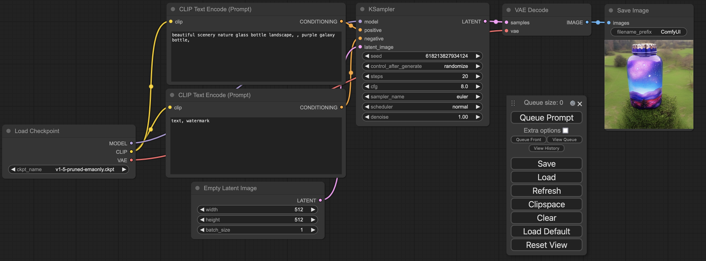

<h1>ComfyUI (NVIDIA) Docker</h1>

- runs in [containers](https://www.gkr.one/blg-20240501-docker101) for enhanced host OS separation
  - work with `docker` (and `compose`) or `podman` using `Windows Subsystem for Linux 2` (WSL2) on Windows (using a Linux Guest Virtual Machine on your Windows host)
- can run multiple setups with an independent `run` folder (for virtual environment management and source code) shared `basedir` folder (for user files, input, output, custom nodes, models, etc.)
- drops privileges to a regular user/preserves user permissions with custom UID/GID mapping (the running user's `id -u` and `id -g` as specified on the command line)
- Integrated `ComfyUI-Manager` for hassle-free updates
  - permits modification of `ComfyUI-Manager`'s security level (`SECURITY_LEVEL`)
- expose to Localhost-only access by default (`-p 127.0.0.1:8188:8188`)
- built on official NVIDIA CUDA containers for optimal GPU performance
- multiple `Ubuntu` + `CUDA` version combinations available --for older hardware: down to `CUDA 12.3.2` / for 50xx GPUs: `CUDA 12.8`-- see the tags list
- separate `run` and `basedir` folders
  - `run` folder is used to store the ComfyUI setup (virtual environment, source code)
  - `basedir` folder is used to store user files, input, output, custom nodes, models, etc.
- command-line override
  - using the `COMFY_CMDLINE_EXTRA` environment variable to pass additional command-line arguments set during the init script
  - ability to run `user_script.bash` from within the container for complex customizations, installations (`pip`, `apt`, ...) and command-line overrides
- pre-built container images available on [DockerHub](https://hub.docker.com/r/mmartial/comfyui-nvidia-docker)
  - including [Unraid](https://unraid.net) compatible images
- open-source: build it yourself using the corresponding `Dockerfile` present in the directory of the same name and review the `init.bash` (i.e. the setup logic)

<h2>USE_UV=true</h2>

**Although `USE_UV` is not enabled by default, it is recommended to use `uv`** instead of `pip` for faster and more reliable installations. The logic to set the proper `UV_TORCH_BACKEND` is already implemented in the main script, so in general, users should not have to set `PREINSTALL_TORCH_CMD`.

<h2>TORCH_LOCK</h2>

`TORCH_LOCK` is a method to force the version and CUDA backend for PyTorch, Torch Vision and Torch Audio. It can be used to prevent Torch upgrading to a newer version that might break your ComfyUI setup.

<h2>GPU specific note</h2>

**DGX Spark**: see the "DGX Spark Support" section.

When using Blackwell (RTX50xx) GPUs: 
- you must use NVIDIA driver 570 (or above).
- use the `ubuntu24_cuda12.8` container tag (or above).
- (recommended) set `USE_UV=true` to enable the use of `uv` instead of `pip`. You should not need to use the `PREINSTALL_TORCH_CMD` parameter.

When using GTX 10xx GPUs: 
- use the `ubuntu24_cuda12.6.3` container tag.
- set `PREINSTALL_TORCH=true` to enable the automatic installation of a CUDA 12.6 version of PyTorch.
- (recommended) set `USE_PIPUPGRADE=false` to disable the use of `pip3 --upgrade`.
- (optional) **after the initial installation only**, set `DISABLE_UPGRADES=true` to disable any Python package upgrade when starting the container (also disables `USE_PIPUPGRADE`, and `PREINSTALL_TORCH` so set only after the initial installation). Use Comfy Manager to upgrade components.
- (optional) set `PREINSTALL_TORCH_CMD=pip3 install torch torchvision torchaudio --index-url https://download.pytorch.org/whl/cu126` to install torch with the `cu126` index-url.

**Note:** If you use a GTX 10xx GPU, please let me know if `USE_UV=true` works for you without using any of the _(optional)_ parameters.

<h2>About "latest" tag</h2>

`latest` now points to the `ubuntu24_cuda12.6.3` tag (as announced in the `20250320` release)

Some installed `custom_nodes` might need to be fixed (`Try Fix`) for `Import Failed` nodes in `ComfyUI-Manager`.
This manual step is only needed once per the `latest` tag update to a different Ubuntu+CUDA version.

To avoid `latest` changing your container's Ubuntu or CUDA version, manually select the docker image tag from the list of available tags.

<h2>Quick Start</h2>

**Windows users, see the Wiki at [https://github.com/mmartial/ComfyUI-Nvidia-Docker/wiki/Windows:-WSL2](https://github.com/mmartial/ComfyUI-Nvidia-Docker/wiki/Windows:-WSL2)**

**Blackwell (RTX 50xx series GPUs) users, see the "Blackwell support" section**

**DGX Spark users, see the "DGX Spark support" section**

Make sure you have the NVIDIA Container Toolkit installed. More details: https://www.gkr.one/blg-20240523-u24-nvidia-docker-podman

To run the container on an NVIDIA GPU, mount the specified directory, expose only to `localhost` on port `8188` (remove `127.0.0.1` to expose to your subnet, and change the port by altering the `-p local:container` port mapping), pass the calling user's UID and GID to the container, and select the `SECURITY_LEVEL`:

```bash
# 'run' will contain your virtual environment(s), ComfyUI source code, and Hugging Face Hub data
# 'basedir' will contain your custom nodes, input, output, user and models directories
mkdir run basedir


# Using docker
docker run --rm -it --runtime nvidia --gpus all -v `pwd`/run:/comfy/mnt -v `pwd`/basedir:/basedir -e USE_UV=true -e WANTED_UID=`id -u` -e WANTED_GID=`id -g` -e BASE_DIRECTORY=/basedir -e SECURITY_LEVEL=normal -p 127.0.0.1:8188:8188 --name comfyui-nvidia mmartial/comfyui-nvidia-docker:latest

# Using podman
podman run --rm -it --userns=keep-id --device nvidia.com/gpu=all -v `pwd`/run:/comfy/mnt -v `pwd`/basedir:/basedir -e USE_UV=true -e WANTED_UID=`id -u` -e WANTED_GID=`id -g` -e BASE_DIRECTORY=/basedir -e SECURITY_LEVEL=normal -p 127.0.0.1:8188:8188 --name comfyui-nvidia docker.io/mmartial/comfyui-nvidia-docker:latest
```

<h2>Smart ComfyUI Gallery</h2>

For users that are looking for a tool to check their generations, check out [Smart Gallery for ComfyUI](https://github.com/biagiomaf/smart-comfyui-gallery). 

> A fast, beautiful, and mobile-friendly gallery to organize and manage all files generated with ComfyUI, including images and videos in any format. Features full management tools, Workflow Download, Node Summary, and support for nested folders. Works standalone, even when ComfyUI is not running.

I have added similar `WANTED_UID` and `WANTED_GID` environment variables to the Smart Gallery for ComfyUI container (and a few other options [PRs 12, 19-21]), so both integrate well with each other.

A pre-built container image and an Unraid version are available.

Check out the [Smart Gallery for ComfyUI](https://github.com/biagiomaf/smart-comfyui-gallery) repository for more details.

<hr>

<h1>ComfyUI (NVIDIA) Docker</h1>

[ComfyUI](https://github.com/comfyanonymous/ComfyUI/tree/master) is a Stable Diffusion WebUI. 
With the addition in August 2024 of a [Flux example](https://comfyanonymous.github.io/ComfyUI_examples/flux/), I created this container builder to test it. 
This container was built to benefit from the process isolation that containers bring and to drop the container's main process privileges to that of a regular user (the container's `comfy` user, which is `sudo` capable).

The base container size is usually over 8GB, as new releases are now based on Nvidia's `devel` images. It contains the required components on an Ubuntu image with Nvidia CUDA and CuDNN (the base container is available from Nvidia's DockerHub); we add the requirements components to support an installation of ComfyUI.

Multiple images are available. Each image's name contains a tag reflecting its core components. For example, `ubuntu24_cuda12.5.1` is based on Ubuntu 24.04 with CUDA 12.5.1. Depending on the version of the Nvidia drivers installed, the Docker container runtime will only support a certain version of CUDA. For example, Driver 550 supports up to CUDA 12.4 and will not be able to run the CUDA 12.4.1 or 12.5.1 versions. The recently released 570 driver supports up to CUDA 12.8 and RTX 50xx GPUs.

For more details on CUDA/GPU support, see https://en.wikipedia.org/wiki/CUDA#GPUs_supported

Use the `nvidia-smi` command on your system to obtain the `CUDA Version:` entry. It will show you the maximum CUDA version supported by your driver. If the printout shows `CUDA Version: 12.6`, your driver will support up to the `cuda12.5.1` version of the container (below the maximum CUDA version supported by the driver) but not `cuda12.8`. With this information, check for a usable `tag`  in the table below.

The `latest` tag will point to a most up-to-date build (i.e., the most recent OS+CUDA). 
If this version is incompatible with your container runtime, please see the list of alternative builds.

| tag | aka | build | note |
| --- | --- | --- | --- |
| ubuntu22_cuda12.2-latest | | linux/amd64 | Ubuntu 22 base image, depreacted as of `20260605` release -- see `Dockerfile/_off` for last used version |
| ubuntu22_cuda12.3-latest | | linux/amd64 | To be depreacted in 2026 | 
| ubuntu22_cuda12.4-latest | | linux/amd64 | To be depreacted in 2026 | 
| ubuntu24_cuda12.5-latest | | linux/amd64 | Ubuntu 24 base image, was `latest` up to `20250320` release |
| ubuntu24_cuda12.6-latest | | linux/amd64 | was `latest` up to `20260509` release |
| ubuntu24_cuda12.8-latest | | linux/amd64 | was `latest` up to `20260605` release -- minimum required for Blackwell (inc RTX 50xx) hardware (see "Blackwell support" section) |
| ubuntu24_cuda12.9-latest | `latest` | linux/amd64 | `latest` as of `20260605` release -- upgrade needed due to ["... Deprecating CUDA 12.8 (Release 2.12)"](https://dev-discuss.pytorch.org/t/introducing-cuda-13-2-and-deprecating-cuda-12-8-release-2-12/3337) |
| ubuntu24_cuda13.0-latest | | linux/amd64 | |
| ubuntu24_cuda13.1-latest | | linux/amd64 | |
| ubuntu24_cuda13.2-latest | | linux/amd64 | |
| ubuntu26_cuda13.3-latest | | linux/amd64 | Ubuntu 26 base image, untested |
| ubuntu24_cuda13.1-dgx-latest | | linux/arm64 | DGX build, recommended for `onnxruntime` support |
| ubuntu26_cuda13.2-dgx-latest | | linux/arm64 | DGX build |
| ubuntu26_cuda13.3-dgx-latest | | linux/arm64 | DGX build, Ubuntu 26 base image |

For more details on driver capabilities and how to update those, please see [Setting up NVIDIA docker & podman (Ubuntu 24.04)](https://www.gkr.one/blg-20240523-u24-nvidia-docker-podman).

During its first run, the container will download ComfyUI from `git` (into the `run/ComfyUI` folder), create a Python virtual environment (in `run/venv`) for all the Python packages needed by the tool, and install [ComfyUI Manager](https://github.com/ltdrdata/ComfyUI-Manager) into ComfyUI's `custom_nodes` directory. 
This adds about 5GB of content to the installation. The download time depends on your internet connection.

Given that `venv` (Python virtual environments) might not be compatible from OS+CUDA-version to version and will create a new `venv` when the current one is not for the expected version.
**An installation might end up with multiple `venv`-based directories in the `run` folder, as the tool will rename existing unusable ones as "venv-OS+CUDA" (for example, `venv-ubuntu22_cuda12.3.2`). To support downgrading if needed, the script will not delete the previous version, and this is currently left to the end-user to remove if not needed**
Using alternate `venv` means that some installed custom nodes might have an `import failed` error. We are attempting to make use of [`cm-cli`](https://github.com/ltdrdata/ComfyUI-Manager/blob/main/docs/en/cm-cli.md) before starting ComfyUI. If that fails, start the `Manager -> Custom Nodes Manager`, `Filter` by `Import Failed`, and use the `Try fix` button as this will download the required packages and install those in the used `venv`. A `Restart` and UI reload will be required to fix issues with the nodes.

You will know the ComfyUI WebUI is running when you check the `docker logs` and see `To see the GUI go to: http://0.0.0.0:8188`

**About 15GB of space between the container and the virtual environment installation is needed.**
This does not consider the models, additional package installations, or custom nodes that the end user might perform.

**ComfyUI's `security_levels` are not accessible until the configuration file is created during the first run.**

It is recommended that a container monitoring tool be available to watch the logs and see when installations are completed or other relevant messages. Some installations and updates (updating packages, downloading content, etc.) will take a long time, and the lack of updates on the WebUI is not a sign of failure.
[Dozzle](https://github.com/amir20/dozzle) is a good solution for following the logs from a WebUI.


- [1. Preamble](#1-preamble)
- [2. Running the container](#2-running-the-container)
  - [2.1. Docker](#21-docker)
    - [2.1.1. docker run](#211-docker-run)
    - [2.1.2. docker compose up](#212-docker-compose-up)
      - [2.1.2.1. docker compose up -- over tailscale](#2121-docker-compose-up----over-tailscale)
  - [2.2. Podman](#22-podman)
    - [2.2.1. podman run](#221-podman-run)
    - [2.2.2. podman compose up](#222-podman-compose-up)
  - [2.3. First time use](#23-first-time-use)
- [3. Docker image](#3-docker-image)
  - [3.1. Building the image](#31-building-the-image)
    - [3.1.1. Using the Makefile](#311-using-the-makefile)
    - [3.1.2. Using a Dockerfile](#312-using-a-dockerfile)
  - [3.2. Availability on DockerHub](#32-availability-on-dockerhub)
  - [3.3. Unraid availability](#33-unraid-availability)
  - [3.4. Nvidia base container](#34-nvidia-base-container)
- [4. Screenshots](#4-screenshots)
  - [4.1. First run: Bottle image](#41-first-run-bottle-image)
  - [4.2. FLUX.1\[dev\] example](#42-flux1dev-example)
- [5. FAQ](#5-faq)
  - [5.1. API nodes](#51-api-nodes)
  - [5.2. Virtualenv](#52-virtualenv)
    - [5.2.1. Multiple virtualenv](#521-multiple-virtualenv)
    - [5.2.2. Fixing Failed Custom Nodes](#522-fixing-failed-custom-nodes)
  - [5.3. Scripts](#53-scripts)
    - [5.3.1. postvenv\_script.bash](#531-postvenv_scriptbash)
    - [5.3.2. user\_script.bash](#532-user_scriptbash)
    - [5.3.3. /userscripts\_dir](#533-userscripts_dir)
    - [5.3.4. /comfyui-nvidia\_config.sh](#534-comfyui-nvidia_configsh)
  - [5.4. Available environment variables](#54-available-environment-variables)
    - [5.4.1. USE\_UV](#541-use_uv)
    - [5.4.2. WANTED\_UID and WANTED\_GID](#542-wanted_uid-and-wanted_gid)
    - [5.4.3. USE\_NEW\_MANAGER](#543-use_new_manager)
    - [5.4.4. COMFY\_CMDLINE\_BASE and COMFY\_CMDLINE\_EXTRA](#544-comfy_cmdline_base-and-comfy_cmdline_extra)
    - [5.4.5. BASE\_DIRECTORY](#545-base_directory)
    - [5.4.6. SECURITY\_LEVEL](#546-security_level)
    - [5.4.7. TORCH\_LOCK](#547-torch_lock)
    - [5.4.8. USE\_SOCAT](#548-use_socat)
    - [5.4.9. FORCE\_CHOWN](#549-force_chown)
    - [5.4.10. USE\_PIPUPGRADE](#5410-use_pipupgrade)
    - [5.4.11. DISABLE\_UPGRADES](#5411-disable_upgrades)
    - [5.4.12. PREINSTALL\_TORCH and PREINSTALL\_TORCH\_CMD](#5412-preinstall_torch-and-preinstall_torch_cmd)
    - [5.4.13. UMASK](#5413-umask)
    - [5.4.14. USE\_COMFY\_CLI](#5414-use_comfy_cli)
  - [5.5. ComfyUI Manager \& Security levels](#55-comfyui-manager--security-levels)
  - [5.6. Shell within the Docker image](#56-shell-within-the-docker-image)
    - [5.6.1. Alternate method](#561-alternate-method)
  - [5.7. Misc](#57-misc)
    - [5.7.1. DGX Spark support](#571-dgx-spark-support)
    - [5.7.2. Blackwell support](#572-blackwell-support)
    - [5.7.3. Specifying alternate folder location (ex: --output\_directory) with BASE\_DIRECTORY](#573-specifying-alternate-folder-location-ex---output_directory-with-base_directory)
    - [5.7.4. run/pip\_cache, run/uv\_cache and run/tmp](#574-runpip_cache-runuv_cache-and-runtmp)
    - [5.7.5. Direct Cloud deployment: GPU Trader](#575-direct-cloud-deployment-gpu-trader)
    - [5.7.6. Stability Matrix Integration](#576-stability-matrix-integration)
    - [5.7.7. LoRA Manager Integration](#577-lora-manager-integration)
    - [5.7.8. My other ComfyUI related projects](#578-my-other-comfyui-related-projects)
      - [5.7.8.1. SafeTensor Cleaner](#5781-safetensor-cleaner)
      - [5.7.8.2. SD Wildcards](#5782-sd-wildcards)
      - [5.7.8.3. "Combined Workflow"](#5783-combined-workflow)
- [6. Troubleshooting](#6-troubleshooting)
  - [6.1. Comfy crash](#61-comfy-crash)
  - [6.2. Virtual environment](#62-virtual-environment)
  - [6.3. run directory](#63-run-directory)
  - [6.4. using BASE\_DIRECTORY with an outdated ComfyUI](#64-using-base_directory-with-an-outdated-comfyui)
  - [6.5. using a specific ComfyUI version or SHA](#65-using-a-specific-comfyui-version-or-sha)
  - [6.6. Errors with ComfyUI WebUI -- re-installation method with models migration](#66-errors-with-comfyui-webui----re-installation-method-with-models-migration)
  - [6.7. Compatibility Warning: Frontend version ... is outdated](#67-compatibility-warning-frontend-version--is-outdated)
  - [6.8. Updating ComfyUI](#68-updating-comfyui)
- [7. Changelog](#7-changelog)

# 1. Preamble

The container is made to run as the `comfy` user, NOT as `root` user. 
Within the container, the final user is `comfy` and the UID/GID is requested at `docker run` time; if none are provided, the container will use `1024`/`1024`.
This is done to allow end users to have local directory structures for all the side data (input, output, temp, user), Hugging Face `HF_HOME` if used, and the entire `models`, which are separate from the container and able to be altered by the user.
To request a different UID/GID at run time, use the `WANTED_UID` and `WANTED_GID` environment variables when calling the container.

Note: 
- for details on how to set up a Docker to support an NVIDIA GPU on an Ubuntu 24.04 system, please see [Setting up NVIDIA docker & podman (Ubuntu 24.04)](https://www.gkr.one/blg-20240523-u24-nvidia-docker-podman)
- If you are new to ComfyUI, see [OpenArt's ComfyUI Academy](https://openart.ai/workflows/academy)
- Some ComfyUI examples:
  - [ComfyUI_examples](https://comfyanonymous.github.io/ComfyUI_examples/)
  - [ComfyUI FLUX examples](https://comfyanonymous.github.io/ComfyUI_examples/flux/)
- Some additional reads:
  - [FLUX.1[dev] with ComfyUI and Stability Matrix](https://www.gkr.one/blg-20240810-flux1dev)
  - [FLUX.1 LoRA training](https://www.gkr.one/blg-20240818-flux-lora-training)

# 2. Running the container

In the directory where we intend to run the container, create the `run` and `basedir` folders as the user with whom we want to share the UID/GID. **This needs to be done before the container is run (it is started as root, so the folders, if they do not exist, will be created as root)** (or give it another name; adapt the `-v` mapping in the `docker run` below). 

That `run` folder will be populated with a few sub-directories created with the UID/GID passed on the command line (see the command line below). 
Among the folders that will be created within `run` are `HF, ComfyUI, venv`
- `HF` is the expected location of the `HF_HOME` (HuggingFace installation directory)
- `ComfyUI` is the git clone version of the tool, with all its sub-directories, among which:
  - `custom_nodes` for additional support nodes, for example, ComfyUI-Manager,
  - `models` and all its sub-directories is where `checkpoints`, `clip`, `loras`, `unet`, etc have to be placed.
  - `input` and `output` are where input images will be placed, and generated images will end up. 
  - `user` is where the user's customizations and saved `workflows` (and ComfyUI Manager's configuration) are stored.
- `venv` is the virtual environment where all the required Python packages for ComfyUI and other additions will be placed. A default ComfyUI package installation requires about 5GB of additional installation in addition to the container itself; those packages will be in this `venv` folder.

**Currently, it is not recommended to volume map folders within the `ComfyUI` folder**. Doing so is likely to prevent proper installation (during the first run) or update, as any volume mapping (`docker ... -v` or `- local_path:container_path` for compose) creates those directories within a directory structure that is not supposed to exist during the initial execution.

The use of the `basedir` is recommended. This folder will be populated at run time with the content from ComfyUI's `input`, `output`, `user` and `models` folders. This allow for the separation of the run time components (within the `run` folder) from the user files. In particular, if you were to delete the `run` folder, you would still have model files in the `basedir` folder.
This is possible because of a new CLI option `--basedir` that was added to the code at the end of January 2025. This option will not be available unless ComfyUI is updated for existing installations.

When starting, the container image executes the `init.bash` script (existing as `/comfyui-nvidia_init.bash` within the container) that performs a few operations:
- load the `/comfyui-nvidia_config.sh` script (`source` it). This script is copied from the host at build time (the `config.sh` file), and can contain override for command line environment variables.
- When starting, the container is using the `comfytoo` user. This user has UID/GID 1025/1025 (ie not a value existing by default in a default Ubuntu installation). 
  - As the `sudo` capable `comfytoo` user, the script will modify the existing `comfy` user to use the `WANTED_UID` and `WANTED_GID`
  - Then, it will re-start the initialization script by becoming the newly modified `comfy` user (which can write in the `run` and `basedir` folders with the provided `WANTED_UID` and `WANTED_GID`).
  - Environment variables for the `comfytoo` user will be shared with the `comfy` user.
- After restarting as the `comfy` user...
- Check that the NVIDIA driver is loaded and show details for the seen GPUs
- Obtain the latest version of ComfyUI from GitHub if not already present in the mounted `run` folder.
- Create the virtual environment (`venv`)  if one does not already exist
  - if one exists, confirm it is the one for this OS+CUDA pair
    - if not, rename it and look for a renamed one that would match
    - if none is found, create a new one
- Activate this virtual environment
- Install all the ComfyUI-required Python packages. If those are already present, additional content should not need to be downloaded.
- Installing ComfyUI-Manager if it is not present.
  - During additional runs, we will allow the user to change the `security_level` from `normal` to another value set using the `SECURITY_LEVEL` environment passed to the container (see the "Security Levels" section of this document for details) to allow for the tool grant more of less functionalities
- Populate the `BASE_DIRECTORY` with the `input`, `output`, `user` and `models` directories from ComfyUI's `run` folder if none are present in the `basedir` folder
  - extend the `COMFY_CMDLINE_EXTRA` environment variable with the `--basedir` option. This variable is `export`ed so that it should be used with any `user_script.bash` if the `BASE_DIRECTORY` is used.
- Run independent user scripts if a `/userscript_dir` is mounted.
  - only executable `.sh` scripts are executed, in alphanumerical order
  - if any script fails, the container will stop with an error
  - environment variables set by the script will be available to the following scripts if they are saved in the `/tmp/comfy_${userscript_name}_env.txt` file, adapting `userscript_name` to the script name (ex: `00-nvidiaDev.sh` would be `/tmp/comfy_00-nvidiaDev_env.txt`)
- Check for a user custom script in the "run" directory. It must be named `user_script.bash`. If one exists, run it.
  - **Make sure to use the `COMFY_CMDLINE_EXTRA` environment variable to pass the `--basedir` option to the tool if running the tool from within this script**
- Run the ComfyUI WebUI. For the exact command run, please see the last line of `init.bash`

If the `FORCE_CHOWN` environment variable is set to any non empty value (ex: "yes"), the script will force change directory ownership as the `comfy` user during script startup (might be slow).

## 2.1. Docker

### 2.1.1. docker run

To run the container on an NVIDIA GPU, mount the specified directory, expose only to `localhost` on port `8188` (remove `127.0.0.1` to expose to your subnet, and change the port by altering the `-p local:container` port mapping), pass the calling user's UID and GID to the container, provide a `BASE_DIRECTORY` and select the `SECURITY_LEVEL`:

```bash
mkdir run basedir
docker run --rm -it --runtime nvidia --gpus all -v `pwd`/run:/comfy/mnt -v `pwd`/basedir:/basedir -e USE_UV=true -e WANTED_UID=`id -u` -e WANTED_GID=`id -g` -e BASE_DIRECTORY=/basedir -e SECURITY_LEVEL=normal -p 127.0.0.1:8188:8188 --name comfyui-nvidia mmartial/comfyui-nvidia-docker:latest
```

### 2.1.2. docker compose up

In the directory where you want to run the compose stack, create the `compose.yaml` file with content similar to the [`compose.yaml`](compose.yaml) file in this repository.

This will use port 8188 (`host:container`). Use a `run` directory local to the directory where this `compose.yml` is, and specify the `WANTED_UID` and `WANTED_GID` to 1000 (adapt to reflect the user and group you want to run as, which can be obtained using the `id` command in a terminal). Make sure to create the `run` and `basedir` directories as the user with the desired uid and gid before running the docker-compose for the first time.

The `compose.yaml` also include an `extra_hosts` section to detail capability to set a custom host name to point to external IP for inclusiom with specific nodes (such as the Ollama node; instead of embedding the IP in the node configuration, we can use a custom host name). 
Similarly, environment variables will be passed to the running container. If you need to pass an API key or a token to the container, add it in the `environment:` section for example `- HF_TOKEN=${HF_TOKEN}` and add an `HF_TOKEN=hf...` in the `.env` file in the same directory as the `compose.yaml` file. 

Start it with `docker compose up` (with `-detached` to run the container in the background)

Please see [docker compose up](https://docs.docker.com/reference/cli/docker/compose/up/) reference manual for additional details.

For users interested in adding it to a [Dockge](https://dockge.kuma.pet/) (a self-hosted Docker Compose stacks management tool ) stack,  please see my [Dockge blog post](https://www.gkr.one/blg-20240706-dockge) where we discuss directory and bind mounts (models take a lot of space).

#### 2.1.2.1. docker compose up -- over tailscale

Tailscale is a overlay network solution with a secure, peer-to-peer service that lets devices connect directly over the internet as if they were on the same local network (using 100. --ie CGNAT-- IPs). Tailscale is a significant part of my homelab access as described in "[Tailscale: subnet router & remote services access](https://www.gkr.one/blg-20250323-tailscale)".

It is possible to run the container without exposing any ports that can be accessed on the local network, and access it only through tailscale. 

To do so, adapt the `compose-tailscale.yaml` file to be your `compose.yaml` file.
For more details on how we are achieving this, review the video from their Knowledge Base at https://tailscale.com/kb/1282/docker

## 2.2. Podman

### 2.2.1. podman run

It is also possible to run the tool using `podman`. Before doing so, ensure the Container Device Interface (CDI) is properly set for your driver. Please see https://www.gkr.one/blg-20240523-u24-nvidia-docker-podman for instructions.
To run the container on an NVIDIA GPU, mount the specified directory, expose only to `localhost` on port `8188` (remove `127.0.0.1` to expose to your subnet, and change the port by altering the `-p local:container` port mapping), pass the calling user's UID and GID to the container, provide a `BASE_DIRECTORY` and select the `SECURITY_LEVEL`:

```bash
mkdir run basedir
podman run --rm -it --userns=keep-id --device nvidia.com/gpu=all -v `pwd`/run:/comfy/mnt -v `pwd`/basedir:/basedir -e WANTED_UID=`id -u` -e WANTED_GID=`id -g` -e BASE_DIRECTORY=/basedir -e SECURITY_LEVEL=normal -p 127.0.0.1:8188:8188 --name comfyui-nvidia docker.io/mmartial/comfyui-nvidia-docker:latest
```

If your system has SELinux, you may need to add `:Z` to the various bind mounts (`-v`) in the `podman run` command. For more details, please see [https://github.com/containers/podman/issues/3415](https://github.com/containers/podman/issues/3415).

### 2.2.2. podman compose up

To use `podman compose up`, modify from the `deploy:` section of the `compose.yaml` file the following:

```yaml
    deploy:
      resources:
        reservations:
          devices:
            - driver: cdi
              device_ids: ['nvidia.com/gpu=all']
              capabilities: [gpu]
    userns_mode: "keep-id"
```

## 2.3. First time use

The first time we run the container, we will go to our host's IP on port 8188 (likely `http://127.0.0.1:8188`) and see the latest run or the bottle-generating example.

Before attempting to run this example, restarting the container is recommended.
The default security model of `normal` is used unless specified, but the needed configuration file is created at the first run of the container. As such, the ComfyUI Manager's default `security_level` can not be modified until the first container restart (after the WebUI ran the first time).

This example requires the [`v1-5-pruned-emaonly.ckpt`](https://huggingface.co/runwayml/stable-diffusion-v1-5/resolve/main/v1-5-pruned-emaonly.ckpt) file which can be downloaded directly from the `Manager`'s "Model Manager".

It is also possible to manually install Stable Diffusion checkpoints, upscale, or Loras (and more) by placing them directly in their respective directories under the `models` folder. For example, to manually install the required "bottle example" checkpoint, as the user with the wanted uid/gid:

```bash
cd <YOUR_BASE_DIRECTORY>/models/checkpoints
wget https://huggingface.co/runwayml/stable-diffusion-v1-5/resolve/main/v1-5-pruned-emaonly.ckpt
```

After the download is complete, click "Refresh" on the WebUI and "Queue Prompt"

Depending on the workflow, some "custom nodes" might be needed. Those should usually be available in the "Manager"'s "Install Missing Custom Nodes".
Other needed files could be found on [HuggingFace](https://huggingface.co/) or [CivitAI](https://civitai.com/).

"Custom nodes" should be installed using the "Manager". The ability to install those manually depends on the `security_levels` selected.

# 3. Docker image

## 3.1. Building the image

### 3.1.1. Using the Makefile


Running `make` will show us the different build targets. That list will differ depending on the available `base` files in the `components` directory

For example, you might see:

Run:
```bash
% make
Available comfyui-nvidia-docker docker images to be built (make targets):
      ubuntu22_cuda12.3.2
      ubuntu22_cuda12.4.1
      ubuntu24_cuda12.5.1

build:          builds all
```

It is possible to build a specific target, such as `make ubuntu22_cuda12.3.2`, or all the available containers.

Running a given target will create a `comfyui-nvidia-docker` `docker buildx`.
As long as none are present, this will initiate a build without caching.

The process will create the `Dockerfile` used within the `Dockerfile` folder. For example, when using `make ubuntu22_cuda12.3.2` a `Dockerfile/Dockerfile-ubuntu22_cuda12.3.2` file is created that will contain the steps used to build the local `comfyui-nvidia-docker:ubuntu22_cuda12.3.2` Docker image.

### 3.1.2. Using a Dockerfile

It is also possible to use one of the generated `Dockerfile` to build a specific image.
After selecting the image to build from the `OS+CUDA` name within the `Dockerfile` folder, proceed with a `docker build` command in the directory where this `README.md` is located.
To build the `ubuntu24_cuda12.5.1` container, run:

```bash
docker build --build-arg COMFYUI_NVIDIA_DOCKER_VERSION="20250817" --build-arg BUILD_BASE="ubuntu24_cuda12.5.1" --tag comfyui-nvidia-docker:ubuntu24_cuda12.5.1 -f Dockerfile/ubuntu24_cuda12.5.1.Dockerfile .
```

The `COMFYUI_NVIDIA_DOCKER_VERSION` is the version of release (in doubt, use the latest release value).

The `BUILD_BASE` must match the OS+CUDA version of the Dockerfile to build. It is used to create the virtual environment. For example, if the `Dockerfile` used is `Dockerfile-ubuntu24_cuda12.5.1`, the `BUILD_BASE` must be `ubuntu24_cuda12.5.1`.

Upon completion of the build, we will have a newly created local  `comfyui-nvidia-docker:ubuntu24_cuda12.5.1` Docker image.

## 3.2. Availability on DockerHub

Builds are available on DockerHub at [mmartial/comfyui-nvidia-docker](https://hub.docker.com/r/mmartial/comfyui-nvidia-docker), built from this repository's `Dockerfile`(s).

The table at the top of this document shows the list of available versions on DockerHub. Make sure your NVIDIA container runtime supports the proposed CUDA version. This is particularly important if you use the `latest` tag, as it is expected to refer to the most recent OS+CUDA release.

## 3.3. Unraid availability

The container has been tested on Unraid and [added to Community Apps an 2024-09-02](assets/Unraid_CA-ComfyUI-Nvidia-Docker.png).

FYSA, if interested, you can see the template from https://raw.githubusercontent.com/mmartial/unraid-templates/main/templates/ComfyUI-Nvidia-Docker.xml


## 3.4. Nvidia base container

Note that the original `Dockerfile` `FROM` is from Nvidia, as such:

```
This container image and its contents are governed by the NVIDIA Deep Learning Container License.
By pulling and using the container, you accept the terms and conditions of this license:
https://developer.nvidia.com/ngc/nvidia-deep-learning-container-license
```

# 4. Screenshots

## 4.1. First run: Bottle image



## 4.2. FLUX.1[dev] example

Template at [Flux example](https://comfyanonymous.github.io/ComfyUI_examples/flux/)


# 5. FAQ

## 5.1. API nodes

"API Nodes are ComfyUI’s new way of calling closed-source models through API requests"
https://docs.comfy.org/tutorials/api-nodes/overview

**The container is not designed to be used with API nodes (even with API keys), only to run self-hosted models.**
If you want to use those, it is recommended to use the Desktop version of ComfyUI from https://www.comfy.org/download

## 5.2. Virtualenv

The container pip installs all required packages in the container and then creates a virtual environment (in `/comfy/mnt/venv` with `comfy/mnt` mounted with the `docker run [...]—v`). 

This allows for the installation of Python packages using `pip3 install` or `uv pip install` (when `USE_UV` is enabled).

After running `docker exec -t comfy-nvidia /bin/bash` from the provided `bash`, activate the `venv` with `source /comfy/mnt/venv/bin/activate`.
From this `bash` prompt, you can now run `pip3 freeze` or other `pip3` commands such as `pip3 install civitai`

### 5.2.1. Multiple virtualenv

Because a `venv` is tied to an OS+CUDA version, the tool attempts to create some internal logic so that the `venv` folder matches the OS+CUDA of the started container.
**Starting two `comfyui-nvidia-docker` containers with different OS+CUDA tags at the same time is likely to cause some issues**

For illustration, let's say we last ran `ubuntu22_cuda12.3.1`, exited the container, and now attempt to run `ubuntu24_cuda12.5.1`. The script initialization is as follows:
- check for an existing `venv`; there is one
- check that this `venv` is for `ubuntu24_cuda12.5.1`: it is not, it is for `ubuntu22_cuda12.3.1`
- move `venv` to `venv-ubuntu22_cuda12.3.1`
- check if there is a `venv-ubuntu24_cuda12.5.1` to renamed as `venv` if present: there is not
- the script continues as if there was no `venv` and a new one for `ubuntu24_cuda12.5.1` is created

Because of this, it is possible to have multiple `venv`-based folders in the "run" folder.

### 5.2.2. Fixing Failed Custom Nodes

A side effect of the multiple virtual environment integration is that some installed custom nodes might have an `import failed` error when switching from one OS+CUDA version to another.
When the container is initialized ,we run `cm-cli.py fix all` to attempt to fix this.
If this does not resolve the issue, start the `Manager -> Custom Nodes Manager`, Filter by `Import Failed`, and use the `Try fix` button. This will download the required packages and install those in the used `venv`. A `Restart` and UI reload will be required, but this ought to fix issues with the nodes.


## 5.3. Scripts

### 5.3.1. postvenv_script.bash

The `run/postvenv_script.bash` script can perform additional operations directly after the virtual environment is created and before ComfyUI is installed (or updated).

This proves useful for installing Python packages that are required for the ComfyUI installation.

Please see additional details about the use of user scripts in the `user_script.bash` section.

### 5.3.2. user_script.bash

The `run/user_script.bash` user script can perform additional operations. 
Because this is a Docker container, updating the container will remove any additional installations not in the "run" directory, so it is possible to force a reinstall at runtime.
It is also possible to bypass the ComfyUI command started (for people interested in trying the `--fast`, for example).

To perform those changes, be aware that:
- The container image is Ubuntu-based.
- The `comfy` user is `sudo` capable.

An example of one could be:

```bash
#!/bin/bash

echo "== Adding system package"
DEBIAN_FRONTEND=noninteractive sudo apt update
DEBIAN_FRONTEND=noninteractive sudo apt install -y nvtop

echo "== Adding python package"
source /comfy/mnt/venv/bin/activate
pip3 install pipx
#uv pip install pipx
echo "== Adding nvitop"
# nvitop will be installed in the user's .local/bin directory which will be removed when the container is updated
pipx install nvitop
# extend the path to include the installation directory
export PATH=/comfy/.local/bin:${PATH}
# when starting a new docker exec, will still need to be run as ~/.local/bin/nvitop
# but will be in the PATH for commands run from within this script

echo "== Override ComfyUI launch command"
# Make sure to have 1) activated the venv before running this command 
# 2) use the COMFY_CMDLINE_EXTRA environment variable to pass additional command-line arguments set during the init script
cd /comfy/mnt/ComfyUI
python3 ./main.py --listen 0.0.0.0 --disable-auto-launch --fast ${COMFY_CMDLINE_EXTRA}

echo "== To prevent the regular Comfy command from starting, we 'exit 1'"
echo "   If we had not overridden it, we could simply end with an ok exit: 'exit 0'" 
exit 1
```

The script will be placed in the `run` directory and must be named `user_script.bash` to be found.

If you encounter an error, it is recommended to check the container logs; this script must be executable and readable by the `comfy` user.
If the file is not executable, the tool will attempt to make it executable, but if another user owns it, the step will fail.

### 5.3.3. /userscripts_dir

🏗️ Please contribute to the `/userscripts_dir` if you have optimization scripts (such as SageAttention or other solutions that require software compilation) that you think would be useful to others or if you find an issue in the scripts provided. The recommended location of scripts to install python packages is the `user_script.bash` file.

⚠️ **WARNING**: This directory is used to run independent user scripts to perform additional operations that might damage your installation. This was added at the request of users trying to install packages from source. **Use with caution**. No support will be provided for issues resulting from the use of this directory. In case of trouble, it is recommended to delete the `run` folder and start a new container.

Scripts (which may not work --please feel free to contribute) provided to add capability to the container. None are executable by default. Those scripts were added to enable end users to install components that needed to be built at the time, not yet supported by ComfyUI Manager, or for which no compatible packages were available.

It is recommended to read at minimum the comments in the header section of each enabled script to understand what it does and how to use it. Some scripts offer to install from known versions or git, you must edit the script to point to the version you want to install.

If a pip version is available, it is recommended to use it instead of the `/userscripts_dir`.

An `tar.gz` archive of the `userscripts_dir` folder is available in the `assets` directory (at [assets/userscripts_dir.tar.gz](assets/userscripts_dir.tar.gz)) to avoid having to download the entire repository. 
To use it, in the folder where your `compose.yaml` is located (or where you plan to create the `run` and `basedir` folders), extract the archive:

```bash
# Replace DONWLOAD_FOLDER with the path to the folder where you downloaded the archive`
tar -xvf ~/DONWLOAD_FOLDER/userscripts_dir.tar.gz
```

The `/userscripts_dir` is a directory that can be mounted to the container: add it to your command line with `-v /path/to/userscripts_dir:/userscripts_dir`.

```bash
docker run [...] -v /path/to/userscripts_dir:/userscripts_dir [...] mmartial/comfyui-nvidia-docker:latest
```

This directory is used to run independent user scripts in order to perform additional operations. Please note that the container **will only run executable `.sh` scripts** in this directory in alphanumerical order (`chmod -x script.sh` to disable execution of a given script). None of the scripts in the folder are executable by default.

Each script differs, so it is recommended to read the comments at the beginining of each script to understand what it does and how to use it (in particular, some will not perform compilation if a previous version of the download folder is present).

A few scripts are provided in the `userscripts_dir` folder:
- [11-onnxruntime-gpu.sh](userscripts_dir/11-onnxruntime-gpu.sh)
- [12-xformers.sh](userscripts_dir/12-xformers.sh)
- [13-nunchaku.sh](userscripts_dir/13-nunchaku.sh), is required to allow the installation of the `nunchaku` custom node.
- [20-SageAttention.sh](userscripts_dir/20-SageAttention.sh), to enable add `--use-sage-attention` to the `COMFY_CMDLINE_EXTRA` environment variable.
- [30-PortAudio.sh](userscripts_dir/30-PortAudio.sh)
- [90_Fix_libmvec-2_error.sh](userscripts_dir/90_Fix_libmvec-2_error.sh)

FAQ: 
- Reserve its usage for installing custom nodes NOT available in ComfyUI Manager. 
- The scripts will be run with the `comfy` user, so you will need to use `sudo` commands if needed. 
- Some scripts might depend on previous scripts, so the order of execution is important: confirm that needed dependencies are met before performing installations.
- If any script fails, the container will stop with an error.
- Environment variables set by the script will be available to the calling script if they are saved in the `/tmp/comfy_${userscript_name}_env.txt` file, adapting `userscript_name` to the script name (`00-nvidiaDev.sh` uses this feature and stores its environment variables in `/tmp/comfy_00-nvidiaDev_env.txt`)
- The scripts will be run BEFORE the user script (`user_script.bash` if any). Those scripts should not start ComfyUI.
- See the existing scripts for details of what can be done.

### 5.3.4. /comfyui-nvidia_config.sh

The `/comfyui-nvidia_config.sh` is a file that can be mounted within the container and can be used to load the entire configuration for the container, instead of setting environment variables on the command line.

Copy and adapt the `config.sh` file to create your own configuration file, uncommenting each section and setting their appropriate values. Then it is possible to run something similar to:

```bash
docker run -it --runtime nvidia --gpus all v `pwd`/config.sh:/comfyui-nvidia_config.sh -v `pwd`/run:/comfy/mnt -v `pwd`/basedir:/basedir -v `pwd`/userscripts_dir:/userscripts_dir -p 8188:8188 mmartial/comfyui-nvidia-docker:latest
```
, i.e. the same command as before, but without any `-e` options (`WANTED_UID`, `WANTED_GID`, `BASE_DIRECTORY` and `SECURITY_LEVEL` are set in the config file)

Note: the file is loaded AFTER the environment variables set on the command line, so the config file will override any environment variables set on the command line.

## 5.4. Available environment variables

### 5.4.1. USE_UV

The `USE_UV` environment variable is used to enable the use of `uv` instead of `pip`.

[`uv`](https://docs.astral.sh/uv/) is a fast, all-in-one Python package & project manager written in Rust. It aims to replace a whole stack of python tools with a single binary that is faster than pip in many cases.

`uv` is also supported by ComfyUI Manager natively when the `use_uv` option is set to `true` in the `basedir/user/default/ComfyUI-Manager/config.ini` file. 
We will attempt to set it to the value of the `USE_UV` environment variable. Similar to `SECURITY_LEVEL`, it will be required to `Restart` ComfyUI to apply the change.

It is currently not set to `true` by default.
It is recommended to set `USE_UV=true` as it make the container start faster and allow for a simpler nodes installation process.

There is also a `UPDATE_UV` variable that can be set to `false` (its default when not set is `true`) to disable `uv` updating itself. This was added to support [Reddit: [Guide] How to securely run ComfyUI on Windows (Docker>WSL2) [RTX 3090, logic can be applied to other hardware]](https://www.reddit.com/r/StableDiffusion/comments/1tq46q0/guide_how_to_securely_run_comfyui_on_windows/).

### 5.4.2. WANTED_UID and WANTED_GID

The `WANTED_UID` and `WANTED_GID` environment variables will be used to set the `comfy` user within the container.
It is recommended that those be set to the end-user's `uid` and `gid` to allow the addition of files, models, and other content within the `run` directory.
Content to be added within the `run` directory must be created with the `uid` and `gid`.

The running user's `uid` and `gid` can be obtained using `id -u` and `id -g` in a terminal.

**Note:** It is not recommended to override the default starting user of the script (`comfytoo`), as it is used to set up the `comfy` user to run with the provided `WANTED_UID` and `WANTED_GID`. The script checks for the `comfytoo` user to do so, then after restarting as the `comfy` user, the script checks that the `comfy` user has the correct `uid` and `gid` and will fail if it has not been able to set it up.

### 5.4.3. USE_NEW_MANAGER

Since ComfyUI 0.5.0, ComfyUI Manager has been integrated into the main ComfyUI application. 
To use it, set the `USE_NEW_MANAGER` environment variable to `true`.
Per https://blog.comfy.org/p/meet-the-new-comfyui-manager the new manager and old one can exist together

Per https://github.com/comfyanonymous/ComfyUI?tab=readme-ov-file#command-line-options the new UI allows the use of the legacy UI by setting the `USE_MANAGER_LEGACY_UI` environment variable to `true`.

Note: with the new manager a new `network_mode` parameter was added to the Manager's config file. 
A `NETWORK_MODE` environment variable has been added to set this parameter to `personal_cloud` for the container to be able to install custom nodes. This setting is set by default, changing it might cause some issues.

### 5.4.4. COMFY_CMDLINE_BASE and COMFY_CMDLINE_EXTRA

You can add extra parameters by adding ComfyUI-compatible command-line arguments to the `COMFY_CMDLINE_EXTRA` environment variable.
For example: `docker run [...] -e COMFY_CMDLINE_EXTRA="--fast --reserve-vram 2.0 --lowvram"`

Note that the `COMFY_CMDLINE_EXTRA` variable might be extended by the init script to match additional parameters such as the `BASE_DIRECTORY` variable.

The default command line used by the script to start ComfyUI is `python3 ./main.py --listen 0.0.0.0 --disable-auto-launch`
This is also the default value set to the `COMFY_CMDLINE_BASE` variable during the initialization script. **It is recommended not to alter the value of this variable, as this might prevent the tool from starting successfully**.

The tool will run the combination of COMFY_CMDLINE_BASE followed by COMFY_CMDLINE_EXTRA. In the above example:
```bash
python3 ./main.py --listen 0.0.0.0 --disable-auto-launch --fast --reserve-vram 2.0 --lowvram
```

In case of container failure, checking the container logs for error messages is recommended.

The tool does not attempt to resolve quotes or special shell characters, so it is recommended that you prefer the `user_script.bash` method.

It is also possible to use the environment variables in combination with the `users_script.bash` by 1) not starting ComfyUI from the script and 2) exiting with `exit 0` (i.e., success), which will allow the rest of the script to continue. The following example installs additional Ubuntu packages and allows for the environment variables to be used:

```bash
#!/bin/bash

#echo "== Update installed packages"
DEBIAN_FRONTEND=noninteractive sudo apt-get update
DEBIAN_FRONTEND=noninteractive sudo apt-get upgrade -y

# Exit with an "okay" status to allow the init script to run the regular ComfyUI command
exit 0
```

Note that `pip install`ation of custom nodes is not possible in `normal` security level, and `weak` should be used instead (see the "Security levels" section for details)

### 5.4.5. BASE_DIRECTORY

The `BASE_DIRECTORY` environment variable is used to specify the directory where ComfyUI will look for the `models`, `input`, `output`, `user` and `custom_nodes` folders. This is a good option to seprate the virtual environment and ComfyUI's code (in the `run` folder) from the end user's files (in the `basedir` folder). For Unraid in particular, you can use this to place the `basedir` on a separate volume, outside of the `appdata` folder.

**This option was added to ComfyUI at the end of January 2025. If you are using an already existing installation, update ComfyUI using the manager before enabling this option.** 

Once enabled, this option should not be disabled in future run.
During the first run with this option, the tool will **move** exisiting content from the `run` directory to the `BASE_DIRECTORY` specified.
This is to avoid having multiple copies of downloaded models (taking multiple GB of storage) in both locations.
**If your `models` directory is large, I recommend doing a manual `mv run/ComfyUI/models basedir/.` before running the container. The volumes are considered separate within the container, so the move operation within the container will 1) perform a file copy for each file within the folder (which will take a while) 2) double the model directory size before it is finished copying before it can delete the previous folder.**
The same logic can be applied to the `input`, `output`, `user`, and `custom_nodes` folders.

### 5.4.6. SECURITY_LEVEL

After the initial run, the `SECURITY_LEVEL` environment variable can be used to alter the default security level imposed by ComfyUI Manager.

When following the rules defined at https://github.com/ltdrdata/ComfyUI-Manager?tab=readme-ov-file#security-policy the user should decide if `normal` will work for their use case. 
You will prefer ' weak ' if you manually install or alter custom nodes.
**WARNING: Using `normal-` will prevent access to the WebUI unless the USE_SOCAT environment variable is set to `true`.**

### 5.4.7. TORCH_LOCK

The `TORCH_LOCK` environment variable can be used to lock torch components to a specific version.

The specific version of torch, torchvision and torchaudio must be provided and will be locked to that version.

**Important**: When using this option, it is the end user's responsibility to ensure that the specified version is compatible with the installed CUDA version. Failure to do so may result in the container failing to start.

Example: `TORCH_LOCK=torch==2.9.1+cu130 torchvision==0.24.1+cu130 torchaudio==2.9.1+cu130`
will force PyTorch to 2.9.1 with CUDA 13.0 support; the values of torchvision and torchaudio, as well as the CUDA backend must be provided.

This will create a `/comfy/mnt/torch_lock.txt` file (ie in the user's `run` folder) with the adapted content of the `TORCH_LOCK` environment variable. This file will be used by the `PIP3_CMD` environmennt variables within the `init.bash` to make sure that the specified versions of torch, torchvision and torchaudio follow the `--constraint /comfy/mnt/torch_lock.txt` flag.
That same `PIP3_CMD` is also used by the `userscript_dir` files.
If you manually install python packages, you should use the copy and use the value of the `PIP3_CMD` environment variable (printed by the `init.bash` script during the container's run) to make sure that the specified versions of torch, torchvision and torchaudio are not modified. At minumum, add the `--constraint /comfy/mnt/torch_lock.txt` flag to the `pip install` command.

When you decide to remove the `TORCH_LOCK` environment variable, it is recommended to also remove the `torch_lock.txt` file in the `run` folder.

### 5.4.8. USE_SOCAT

The `USE_SOCAT` environment variable is used to enable an alternate service behavior: have ComfyUI listen on `127.0.0.1:8181` and use `socat` to expose the service on `0.0.0.0:8188`.

The default is to run ComfyUI within the container to listen on `0.0.0.0:8188` (i.e., all network interfaces), which is needed to make it accessible on the exposed port outside of the running container.

Some `SECURITY_LEVEL` settings might prevent access to the WebUI unless the tool is running on `127.0.0.1` (i.e., only the host). The `USE_SOCAT=true` environment variable can be used to support this behavior.

### 5.4.9. FORCE_CHOWN

The `FORCE_CHOWN` environment variable is used to force change directory ownership as the `comfy` user during script startup (this process might be slow).

This option was added to support users who mount the `run` and `basedir` folders onto other hosts which might not respect the UID/GID of the `comfy` user.

When set with any non empty value other than `false`, `FORCE_CHOWN` will be enabled.

When set, it will "force chown" every sub-folder in the `run` and `basedir` folders when it first attempt to access them before verifying they are owned by the proper user.

### 5.4.10. USE_PIPUPGRADE

The `USE_PIPUPGRADE` environment variable is used to enable the use of `pip3 install --upgrade` to upgrade ComfyUI and other Python packages to the latest version during startup. If not set, it will use `pip3 install` to install packages.

This option is enabled by default as with the sepraation of the UI from the Core ComfyUI code, it is possible to be off-synced with the latest version of the UI.

It can be disabled by setting `USE_PIPUPGRADE=false`.

### 5.4.11. DISABLE_UPGRADES

The `DISABLE_UPGRADES` environment variable is used to disable upgrades when starting the container (also disables `USE_PIPUPGRADE` and `PREINSTALL_TORCH`).

This option is disabled by default (set to `false`) as it is recommended to keep the UI up to date (since it was decoupled from the core code). To enable its features, set `DISABLE_UPGRADES=true`. 

It is recommended to only use it on an installation after its initial setup (especially if you plan to use `PREINSTALL_TORCH`: it will bypass this step as well), as it will attempt to prevent Comfy and other Python packages from being upgraded outside of the WebUI. Any package update will have to be performed through the WebUI (ComfyUI Manager).

### 5.4.12. PREINSTALL_TORCH and PREINSTALL_TORCH_CMD

The `PREINSTALL_TORCH` environment variable will attempt to automatically install/upgrade `torch` after the virtual environment is created.

It will also check the version of CUDA supported by the container such that for CUDA 12.8, it will install `torch` with the `cu128` index-url.

This option is enabled by default. It can be disabled by setting `PREINSTALL_TORCH=false`.

The `PREINSTALL_TORCH_CMD` environment variable can be used to override the torch installation command with the one specified in the variable. For example for GTX 1080, try to use `PREINSTALL_TORCH_CMD=pip3 install torch torchvision torchaudio --index-url https://download.pytorch.org/whl/cu126`. It is likely also recommended to not set `USE_PIPUPGRADE=false` in this case.

Please note that the `PREINSTALL_TORCH_CMD` variable is not added to the Unraid template, and must be manually added if used.

### 5.4.13. UMASK

The default `umask` is `0022` (files readable by others).
The environment variable allows the override of this value to `0077` for example (no one but the user).
### 5.4.14. USE_COMFY_CLI

The `USE_COMFY_CLI` environment variable is used to enable the use of the `comfy` command line.
On fresh installs, it will be used to install ComfyUI and the Manager (this will set `USE_NEW_MANAGER` to true) at the usual `run/ComfyUI` location, using [comfy-cli](https://github.com/Comfy-Org/comfy-cli) (via its `--workspace` option) instead of a plain `git clone`.

It is currently not set to `true` by default. When enabled, `comfy-cli` is installed (via `PIP3_CMD`, so it follows `USE_UV` like any other package) once the virtual environment is ready, then used only to obtain/restore the ComfyUI checkout itself. Torch, `requirements.txt`, and ComfyUI Manager continue to be installed by this script's own logic (so `TORCH_LOCK`, `USE_UV`, and `USE_NEW_MANAGER` all behave the same either way).

## 5.5. ComfyUI Manager & Security levels

[ComfyUI Manager](https://github.com/ltdrdata/ComfyUI-Manager/) is installed and available in the container.

The container is accessible on `0.0.0.0` internally to the container (i.e., all network interfaces), but it is only accessible on the exposed port outside of the running container.

To modify the `security_level`:
- manually: by going into your "run" folder directory and editing either `ComfyUI/user/default/ComfyUI-Manager/config.ini` if present, otherwise `custom_nodes/ComfyUI-Manager/config.ini` and alter the `security_level = ` to match your requirements (then reload ComfyUI)
- automatically: use the `SECURITY_LEVEL` docker environment variable at run time to set it for this run.

Note that if this is the first time starting the container, the file will not yet exist; it is created the first time ComfyUI is run. After this step, stop and restart the container; the `config.ini` will be there at consecutive restarts

To use `cm-cli`, from the virtualenv, use: `python3 /comfy/mnt/custom_nodes/ComfyUI-Manager/cm-cli.py`.
For example: `python3 /comfy/mnt/custom_nodes/ComfyUI-Manager/cm-cli.py show installed` (`COMFYUI_PATH=/ComfyUI` should be set)

## 5.6. Shell within the Docker image

When starting a `docker exec -it comfyui-nvidia /bin/bash` (or getting a `bash` terminal from `docker compose`), you will be logged in as the `comfytoo` user.

Switch to the `comfy` user with:
```bash
sudo su -l comfy
```

As the `comfy` user you will be using the `WANTED_UID` and `WANTED_GID` provided. 
You will be able to `cd` into the mounted locations for the `run` and `basedir` folders. 

```bash
source /comfy/mnt/venv/bin/activate
```

to get the virtual environment activated (allowing you to perfom `pip3 install` operations as those will be done within the `run` folder, so outside of the container), and other operations that the `comfy` user is allowed to perform.

**Note:** as a reminder the `comfy` user is `sudo` capable, but `apt` commands might not persist a container restart, use the `user_script.bash` method to perform `apt` installs when the container is started.

### 5.6.1. Alternate method

It is possible to pass a command line override to the container by adding it to the `docker run ... mmartial/comfyui-nvidia-docker:latest` command.

For example: `docker run ... -it ... mmartial/comfyui-nvidia-docker:latest /bin/bash`

This will start a container and drop you into a bash shell as the `comfy` user with all mounts and permissions set up.

## 5.7. Misc

### 5.7.1. DGX Spark support

As of the 20260312 release, a DGX Spark version of the image is available on DockerHub.

The DGX Spark is an ARM64 based GPU, and as such, it requires a different image to be used.
The base `FROM` is different from x86_64. 
Beside this, the DGX version is not too different from the other versions for `x86_64` and use the same base components to build and run, just a different base image. The main difference is that the DGX version makes use of the `userscripts_dir` folder to install additional components, such as the required "Sage Attention" used in the proposed [compose-dgx_spark.yml](compose-dgx_spark.yml) file.

Please check [extras/dgx_spark-helper.sh](extras/dgx_spark-helper.sh) and [compose-dgx_spark.yml](compose-dgx_spark.yml) for example usage.

Recommended steps:

- in the file where you place the `compose-dgx_spark.yml` file (ie renamed as `compose.yaml` for convention in the rest of this explanation), create two folders as the same user ID as the one used to start the container (usually `1000:1000`): `mkdir run basedir`
- obtain a copy of [userscripts_dir.tar.gz](https://github.com/mmartial/ComfyUI-Nvidia-Docker/blob/main/assets/userscripts_dir.tar.gz) file and uncompress it in the same folder where your `compose.yaml` is. `tar xvfj userscripts_dir.tar.gz` will create the `userscripts_dir` folder owned by `1000:1000` (`chown` accordingly). You will neeed to `chmod +x` files in there. The `compose.yaml` has a list of recommended numbers in the comments, they match the scripts "numbers". Use `chmod +x userscripts_dir/20-SageAttention2.sh` at minimum to allow the `--use-sage-attention` added to the `compose.yaml`. You will see a few other useful scripts there: 00, 05, 11, 15, 21 for example. You might not need all listed scripts; adapt as preferred.
- Once the preliminary setup is completed, look at the content of the `compose.yaml` and adapt to your requirements; in particular the `WANTED_UID` and `WANTED_GID` or other settings as described in the `README.md`.
- `docker compose up` should give you access to ComfyUI on `http://localhost:8188`.

The `compose-dgx_spark.yml` contains a few comments to explain the choices made for the DGX Spark as well as some settings to enable after the first run (like `ONNXRUNTIME_DO_NOT_DELETE_GPU_IF_PRESENT` to avoid rebuilding onnxruntime from source on every run -- after the initial build).

To build your own container: needed: `git`, `make`, `docker`. The following commands will build a version of the image using `linux/arm64` as the platform.

```bash
# Clone the repository
git clone https://github.com/martial/comfyui-nvidia-docker.git

# Build the Docker image
cd comfyui-nvidia-docker
make
# will return a list of target, pick the one you prefer
# Warning: currently only CUDA 13.1 can use onnxruntime https://github.com/microsoft/onnxruntime/issues/28023
make ubuntu24_cuda13.1-dgx

# Check the name of the image that was built
make docker_tag_list
```

The local image name will something like `comfyui-nvidia-docker:ubuntu24_cuda13.1-dgx`. Use this value in the `image:` section of the `docker-compose.yml` file; ie it should read: `image: comfyui-nvidia-docker:ubuntu24_cuda13.1-dgx`. Similaryly, if starting the container with `docker run`, it should read: `docker run ... comfyui-nvidia-docker:ubuntu24_cuda13.1-dgx`.

### 5.7.2. Blackwell support

It is recommended to compile SageAttention2 and SageAttention3 (see [userscripts_dir/21-SageAttention3-BlackwellOnly.sh](userscripts_dir/21-SageAttention3-BlackwellOnly.sh)). For SageAttention2, it is recommended to use the `2-git` version (edit the file [20-SageAttention2.sh](userscripts_dir/20-SageAttention2.sh) and change `sageattention_version` to `2-git`).

If using `nvfp4` models, make sure to install [`comfy_kitchen`](https://github.com/Comfy-Org/comfy-kitchen) as well as the [ComfyUI_Kitchen_nvfp4_Converter](https://github.com/tritant/ComfyUI_Kitchen_nvfp4_Converter) custom node. I have succesfully used it to convert multiple CivitAI `fp16` models to `nvfp4` with no issues.

To use the Blackwell GPU (RTX 5080/5090), you will need to make sure to install NVIDIA driver 570 or above. This driver brings support for the RTX 50xx series of GPUs and CUDA 12.8. 

On 20250424, PyTorch 2.7.0 was released with support for CUDA 12.8.

With the 20250713 release, we are attempting to automatically select the `cu128` index-url when CUDA 12.8 (or above) is detected, making the `PyTorch2.7-CUDA12.8.sh` script unnecessary.

### 5.7.3. Specifying alternate folder location (ex: --output_directory) with BASE_DIRECTORY

The `BASE_DIRECTORY` environment variable can be used to specify an alternate folder location for `input`, `output`, `temp`, `user`, `models` and `custom_nodes`.
The ComfyUI CLI provides means to specify the location of some of those folders from the command line.
- `--output-directory` for `output`
- `--input-directory` for `input`
- `--temp-directory` for `temp`
- `--user-directory` for `user`
Each one of those option overrides `--base-directory`.

The logic in `init.bash` moves the content of `input`, `output`, `temp`, `user` and `models` to the specified `BASE_DIRECTORY` the first time it is used if the destination folder does not exist.

The script logic is based on the `BASE_DIRECTORY` environment variable alone. For end-users who prefer to use one of those alternate folder command lines, those can be added to either the `COMFY_CMDLINE_EXTRA` environment variable or the `user_script.bash` script (please refer to the other sections of this document that describe those options).

Indepent of the method used the core logic is the same (the example will specify the `output` folder):
1. you will need to make sure a new folder is mounted within the container (ex: `docker run ... -v /preferredlocation/output:/output`)
2. tell the ComfyUI command line to use that location for its outputs: `python3 ./main.py [...] --output-directory /output`
3. (optional) make sure to copy the already existing content of `output` to the new location if you want consitency.

Please note that an `output` folder will still exist in the `basedir` location (per the `BASE_DIRECTORY` logic) but the comamnd line option will tell Confy to override it.

For Unraid users, those steps can done by editing the template from the `Docker` tab, `Edit`ing the container and using `Add another Path, Port, Variable, Label or Device` to:
1. add a new `Path` entry (name it `output directory`) with a `Container Path` with value `/output`, a `Host Path` with your selected lcoation, for example `/preferredlocation/output`, and an `Access Mode` of `Read/Write`.
2. edit the existing `COMFY_CMDLINE_EXTRA` variable to add the `--output-directory /output` option.

### 5.7.4. run/pip_cache, run/uv_cache and run/tmp

If the `run/pip_cache` and `run/tmp` folders are present, they will be used as the cache folder for pip and the temporary directory for the comfy user. They should be created in the `run` folder before running the container starts with the user with the `WANTED_UID` and `WANTED_GID`.

```bash
# For example
mkdir -p run basedir run/pip_cache run/tmp
```

If used, various `pip install` commands will write content to those folders (mounted as part of `run`) instead of within the container.
This can be useful to avoid using the container's `writeable` layers, which might be limited in size on Unraid systems.

The `run/uv_cache` folder is automatically created when using `USE_UV=true`.

Those are temporary folders, and can be deleted when the container is stopped.

### 5.7.5. Direct Cloud deployment: GPU Trader

[GPU Trader](https://www.gputrader.io/) is using the container as the base for their ComfyUI deployment, and their first "One-Click Deployments" that provides "ComfyUI, a file browser, Jupyter Notebook, and a terminal providing persistent storage and full access to create AI imagery".

If you are curious and want to learn more, check [this video](https://supercut.ai/share/gpu-trader/wb9biA0-r8H8dh1UKTL4k7).

### 5.7.6. Stability Matrix Integration

Please see [Stability Matrix Integration](https://github.com/mmartial/ComfyUI-Nvidia-Docker/wiki/Stability-Matrix-integration) (wiki page) for more information.

### 5.7.7. LoRA Manager Integration

Please see [LoRA Manager Integration](https://github.com/mmartial/ComfyUI-Nvidia-Docker/wiki/LoRA-Manager-Integration) (wiki page) for more information.

### 5.7.8. My other ComfyUI related projects

#### 5.7.8.1. SafeTensor Cleaner

A python script designed to help keep our Stable Diffusion (ComfyUI, [Stability Matrix](https://github.com/mmartial/ComfyUI-Nvidia-Docker/wiki/Stability-Matrix-integration), [LoRA Manager](https://github.com/mmartial/ComfyUI-Nvidia-Docker/wiki/LoRA-Manager-Integration) or other tools) model collection organized. 
It manages "sidecar" files—like preview images (`.preview.png`), info files (`.civitai.info`), and metadata—ensuring they stay with their models and don't clutter your folders (especially after a model deletion).

For more details, see [SafeTensor Cleaner](https://github.com/mmartial/ComfyUI_misc/tree/main/Safetensor_Cleaner).

#### 5.7.8.2. SD Wildcards

For people that like to use wildcards in their generation, I have created a set of those.
Please see [https://github.com/mmartial/ComfyUI_misc](https://github.com/mmartial/ComfyUI_misc) for details on how to use those and individual links to CivitAI for each of them.

#### 5.7.8.3. "Combined Workflow"

This was an attempt to provide a workflow to use the wildcards in ComfyUI.
It has grown to be a full-fledged experiment that uses a set of custom nodes, can make use of Ollama to extend workflows and generates Illustrious/Flux/ZImage results.

I have added those in the "SD Wildcard" repository, but recommend checking CivitAI at [https://civitai.com/models/2149956](https://civitai.com/models/2149956) for the published version.

# 6. Troubleshooting

## 6.1. Comfy crash

It is possible that despite the container starting and setting itself up correctly, ComfyUI will crash.
You will recognize this in the Docker log as `!! ERROR: ComfyUI failed or exited with an error`.
The log might contain the reason for the crash, but you can also look up the ComfyUI logs in the container to get more details. Those are in `basedir/user/*.log`.
If Comfy crashes after it succesfully performs its internal checks (starts (`Starting server`) it is likely a Comfy/custom node error and not related to the container itself.

## 6.2. Virtual environment

The `venv` in the "run" directory contains all the Python packages the tool requires.
In case of an issue, it is recommended that you terminate the container, delete (or rename) the `venv` directory, and restart the container. 
The virtual environment will be recreated; any `custom_scripts` should re-install their requirements; please see the "Fixing Failed Custom Nodes" section for additional details.

## 6.3. run directory

It is also possible to rename the entire "run" directory to get a clean installation of ComfyUI and its virtual environment. This method is preferred, compared to deleting the "run" directory—as it will allow us to copy the content of the various downloaded `ComfyUI/models`, `ComfyUI/custom_nodes`, generated `ComfyUI/outputs`, `ComfyUI/user`, added `ComfyUI/inputs`, and other folders present within the old "run" directory.
If using the `BASE_DIRECTORY` environment variable, please note that some of that `run` directory content will be moved to the `BASE_DIRECTORY` specified.

## 6.4. using BASE_DIRECTORY with an outdated ComfyUI

If using the `BASE_DIRECTORY` option and the program exit saying the `--base-directory` option does not exist, this is due to an outdated ComfyUI installation. A possible solution is to disable the option, restart the container and use the ComfyUI-Manager to update ComfyUI. Another option is manually update the code: `cd run/ComfyUI; git pull`
In some case, it is easier to create a simple `user_script.bash` to perform those steps; particularly on Unraid.
The `run/user_script.bash` file content would be (on Unraid it would go in `/mnt/user/appdata/comfyui-nvidia/mnt`)

```bash
#!/bin/bash

cd /comfy/mnt/ComfyUI
git pull

exit 0
```

Make sure to change file ownership to the user with the `WANTED_UID` and `WANTED_GID` environment variables and to make it executable (on Unraid in the directory, run `chown nobody:users user_script.bash; chmod +x user_script.bash`)

**After the process complete, you should be presented with the WebUI. Make to delete or rename the script to avoid upgrading ComfyUI at start time, and use ComfyUI Manager instead.**

## 6.5. using a specific ComfyUI version or SHA

Following the conversation in https://github.com/mmartial/ComfyUI-Nvidia-Docker/issues/32
Use a `user_script.bash` to install a specific version of ComfyUI

```bash
#!/bin/bash

# Checkout based on SHA (commit) 
cd /comfy/mnt/ComfyUI
git checkout SHAvalue

# Install required packages (note that this might cause some downgrades -- some might not be possible)
source /comfy/mnt/venv/bin/activate
pip3 install -r requirements.txt

exit 0
```

Adapt the `SHAvalue` to match your desired version.

Make sure to change file ownership to the user with the `WANTED_UID` and `WANTED_GID` environment variables and to make it executable

**After the process complete, you should be presented with the WebUI. Make sure to delete or rename the script to avoid it being run again.**

## 6.6. Errors with ComfyUI WebUI -- re-installation method with models migration

Sometimes a `custom_nodes` might cause the WebUI to fail to start, or error out with a message (ex: `Loading aborted due to error reloading workflow data`). In such cases, it is recommended to start from a brand new `run` and `basedir` folders, since `run` contains ComfyUI and the `venv` (virtual environment) that is required to run the WebUI, and `basedir` contains the `models` and `custom_nodes`. Because we would prefer to not have to redownload the models, the following describes a method to do so, such that you will be able to copy the content of the `models` folder from a `_old ``run` and `basedir` folders to the new ones.

Process:
- `docker stop comfyui-nvidia` and `docker rm comfyui-nvidia` the container. We will need to start a new one so that no cached data is used. This will require a fresh installation of all the packages used by ComfyUI.
- in the folder where your `run` and `basedir` are located, move the old folders to `run_off` and `basedir_off` and recreate new empty ones: `mv run run_off; mv basedir basedir_off; mkdir run basedir`
- `docker run ...` a new container, which will reinstall everything as new. We note that none of the custom nodes will be installed. You will need to install each custom node manually after the process is complete (or redownload them from the ComfyUI-Manager by using older workflows embedded images)
- after successful installation and confirmation that the WebUI is working, `docker stop comfyui-nvidia` the container but do not delete it
- in the folder where your new `run` and `basedir` are located, replace the models with the `_old` ones: `rm -rf basedir/models; mv basedir_off/models basedir/`
- `docker start comfyui-nvidia` to restart the container, and test custom nodes installation by using the manager to enable `ComfyUI-Crystools`, follow the instructions and reload the WebUI

You will still have previous content in the `run_off` and `basedir_off` folders, such as `basedir_off/output`, ...

From `run_off/custom_nodes`. you will be able to see the list of custom nodes that were installed in the old container and can decided to reinstall them from the manager.

Once you are confident that you have migrated content from the old container's folders, you can delete the `run_off` and `basedir_off` folders.

## 6.7. Compatibility Warning: Frontend version ... is outdated

Some users have reported a warkaround for the issue if it appears:

> update [the] frontend with the the command comfyui shows you when you start the container with an old frontend. You find the command in the container protocol. In my case the command is `/comfy/mnt/venv/bin/python3 -m pip install -r /comfy/mnt/ComfyUI/requirements.txt`
> You can now start your container command line and just copy and paste this command. The frontend will be updaded and after a container restart you will have the new frontend.

For more details, see [this thread on the Unraid forum](https://forums.unraid.net/topic/172874-support-comfyui-nvidia-docker/page/5/#findComment-1588490).

## 6.8. Updating ComfyUI

A method to update ComfyUI is to force the re-installation of the complete system to the latest version. To do this, take the container down, delete your `run` folder, and recreate a new one. then start a new container. During the initialalization, it will see that the `run` folder does not have ComfyUI or its `venv` and will reinstall it.

An alternate method has you using `USE_NEW_MANAGER=false` and `ENABLE_MANAGER_LEGACY_UI=true`. Then from the `Extensions` menu on the WebUI, access `ComfyUI Manager`, select `Switch ComfyUI` and select the version you want to install. After it is done installing, do not click the `Restart` button. Instead take down your container, and restart it. This is needed for the installation of packages required by the updated `requirements.txt` from the different version of ComfyUI.

For additional details, see [Issue 132](https://github.com/mmartial/ComfyUI-Nvidia-Docker/issues/132).

# 7. Changelog

- 20260905: Added `USE_COMFY_CLI` environment variable to optionally install ComfyUI via [comfy-cli](https://github.com/Comfy-Org/comfy-cli)'s `--workspace` option instead of a plain `git clone`.
- 20260805: Added compatibility for first Ubuntu 26.04 images + full ffmpeg/sqlite3 for sub-scripts + note: cu132 is now supported by uv but Comfy still prefers cu130 (torchaudio does not have a cu132 version)
- 20260605: Added `UPDATE_UV` variable, moving `latest` to CUDA 12.9 release (following ["Introducing CUDA 13.2 and Deprecating CUDA 12.8 (Release 2.12)"](https://dev-discuss.pytorch.org/t/introducing-cuda-13-2-and-deprecating-cuda-12-8-release-2-12/3337) + deprecation of CUDA 12.2 release.
- 20260509: As announced previously, updated `latest` to CUDA 12.8 release. No new features: maintenance release + updated CUDA 13.0. 13.1 and 13.2 versions.
- 20260312: Added DGX Spark build and notes on Blackwell nvfp4 usage. Update all images to recent pacakges (unless a new feature is added and a rebuild is required, I likely will do this every couple of months to allow the image to stay up to date with published package fixes).
- 20260121: Added `TORCH_LOCK` environment variable to manually lock torch components to a specific version
- 20260110: Fix [Issue 106](https://github.com/mmartial/ComfyUI-Nvidia-Docker/issues/106) + Updating git origin to point to the new repository at [Comfy-Org/ComfyUI](https://github.com/Comfy-Org/ComfyUI)
- 20260106: (no new release) Added new container for DGX Spark 
- 20260104: reversing git origin to point to the old repository until the transition is completed
- 20251230: `pyvmml` uninstallation fix
- 20251229: Update git origin to point to the new repository + renaming image name to be "CUDA major.minor" + added local caching to speed up the build process (and amount of download)
- 20251228: fix a "FutureWarning" in `pynvml`
- 20251227: (no new release) Updated `userscripts_dir` with Nunchaku 1.1.0 + Added `build-dgx` target to change the build target to `linux/arm64` (see [Issue 96](https://github.com/mmartial/ComfyUI-Nvidia-Docker/issues/96))
- 20251222: (no new release) Added `ubuntu24_cuda13.1` build
- 20251219: Added `USE_NEW_MANAGER` and `ENABLE_MANAGER_LEGACY_UI` to support new Manager introduced in Comfy 0.5
- 20251211: Updated [ComfyUI Manager `config.ini` path](https://github.com/Comfy-Org/ComfyUI-Manager/blob/main/docs/en/v3.38-userdata-security-migration.md): it is recommended to see  [Issue 92](https://github.com/mmartial/ComfyUI-Nvidia-Docker/issues/92#issuecomment-3644751710) for more details.
- 20251129: Recommended `USE_UV` environment variable to enable the use of `uv` instead of `pip` (must be manually set to `true` to enable) + Extended `uv` integration (including `UV_TORCH_BACKEND`) + Extended `userscripts_dir` integration with `uv` and `--index-url` as set in the main script + Integrated pip dev package installation from the main script so it is available to userscripts + Tested CUDA 13.0 + Extended `README.md` for topics such as "frontend version outdated" and [Smart Gallery for ComfyUI](https://github.com/biagiomaf/smart-comfyui-gallery) information.
- 20251122: Added `USE_UV` environment variable to enable the use of `uv` instead of `pip` (not enabled by default) + updated some `userscripts_dir` to support `uv` + fix `config.ini` alterations in non-alphanumeric entries + attempt to fix the DB initialization issue (reported in [Issue 81](https://github.com/mmartial/ComfyUI-Nvidia-Docker/issues/81))
- 20251006: Fix environment variable loading (side effect of fix for loading configuration file overrides, as reported in [Issue 78](https://github.com/mmartial/ComfyUI-Nvidia-Docker/issues/78))
- 20251005: Fix loading configuration file overrides (e.g. `comfyui-nvidia_config.sh`) + extended `userscripts_dir` to support Nunchaku and xformers.
- 20251001: Added additional libraries to the base image to support a few custom nodes + new userscripts_dir script for onnxruntime + added Tailscale Docker Compose usage.
- 20250817: Added automatic PyTorch selection for `PREINSTALL_TORCH` environment variable based on CUDA version + added `DISABLE_UPGRADES` and `PREINSTALL_TORCH_CMD` environment variables.
- 20250713: Attempting to automatically select the `cu128` index-url when CUDA 12.8 (or above) is detected when using the `PREINSTALL_TORCH` environment variable (enabled by default).
- 20250607: Added `USE_PIPUPGRADE` and `USE_SOCAT` environment variables + added CUDA 12.9 build.
- 20250503: Future proof [extras/PyTorch2.7-CUDA12.8.sh](./extras/PyTorch2.7-CUDA12.8.sh) to use `torch>=2.7` instead of `torch==2.7.0` + added `run/pip_cache` and `run/tmp` folders support
- 20250426: Added support for `postvenv_script.bash` script (run after the virtual environment is set but before ComfyUI is installed/updated -- with a direct application to Blackwell GPUs to install PyTorch 2.7.0 with CUDA 12.8 support). See [extras/PyTorch2.7-CUDA12.8.sh](./extras/PyTorch2.7-CUDA12.8.sh) for details.
- 20250424: No RTX50xx special case needed: PyTorch 2.7.0 is available for CUDA 12.8, only re-releasing this image
- 20250418: use ENTRYPOINT to run the init script: replaced previous command line arguments to support command line override + Added content in `README.md` to explain the use of `comfytoo` user & a section on reinstallation without losing our existing models folder.
- 20250413: Made CUDA 12.6.3 the new `latest` tag + Added support for `/userscripts_dir` and `/comfyui-nvidia_config.sh` 
- 20250320: Made CUDA 12.6.3 image which will be the new `latest` as of the next release + Added checks for directory ownership + added `FORCE_CHOWN` + added libEGL/Vulkan ICD loaders and libraries (per https://github.com/mmartial/ComfyUI-Nvidia-Docker/issues/26) including extension to Windows usage section related to this addition
- 20250227: Simplified user switching logic using the `comfytoo` user as the default entry point user that will set up the `comfy` user
- 20250216: Fix issue with empty `BASE_DIRECTORY` variable
- 20250202: Added `BASE_DIRECTORY` variable
- 20250116: Happy 2nd Birthday ComfyUI -- added multiple builds for different base Ubuntu OS and CUDA combinations + added `ffmpeg`  into the base container.
- 20250109: Integrated `SECURITY_LEVELS` within the docker arguments + added `libGL` into the base container.
- 20240915: Added `COMFY_CMDLINE_BASE` and `COMFY_CMDLINE_EXTRA` variable
- 20240824: Tag 0.2: shift to pull at first run-time, user upgradable with lighter base container
- 20240824: Tag 0.1: builds were based on ComfyUI release, not user upgradable
- 20240810: Initial Release
